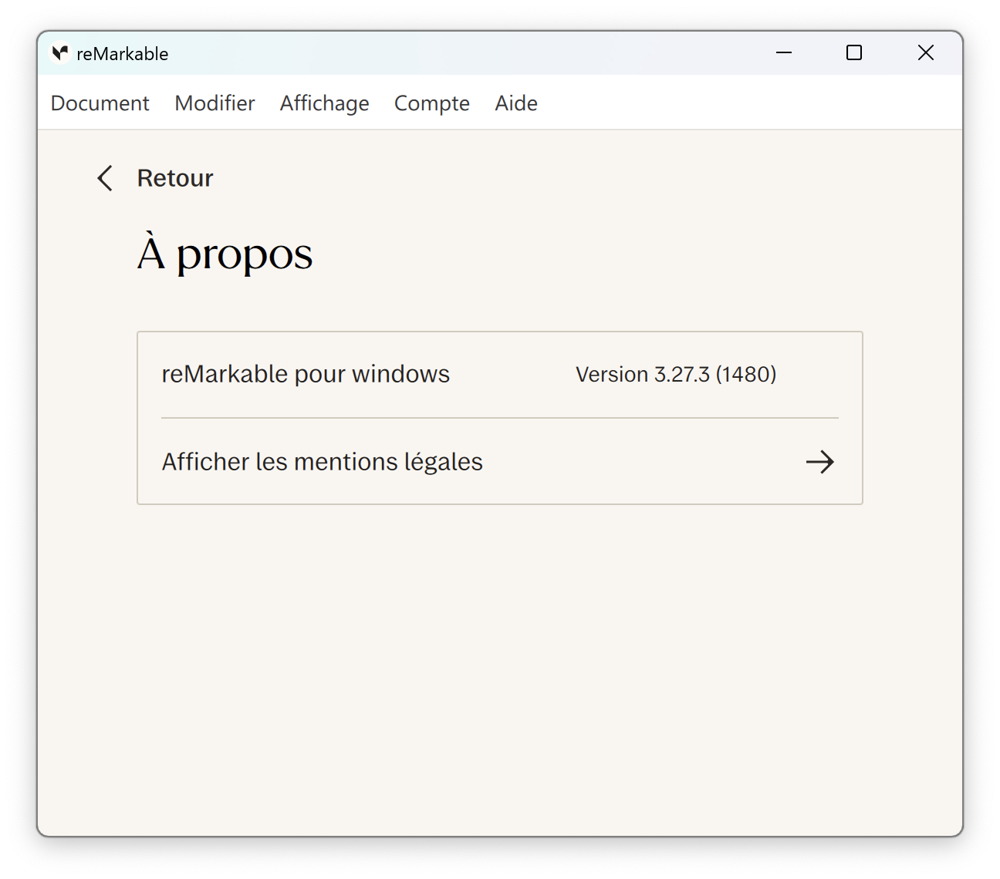
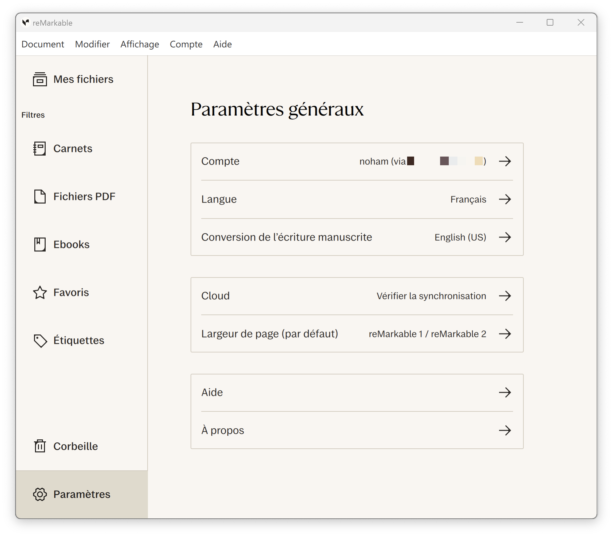

# RMHook-Win

A Windows port of [RMHook](https://github.com/NohamR/RMHook) for the reMarkable Desktop application. This repo builds a proxy DLL that hooks Qt network APIs and redirects reMarkable cloud traffic to a self-hosted [rmfakecloud](https://github.com/ddvk/rmfakecloud) server.

## Overview

RMHook-Win intercepts the reMarkable Desktop app's Qt networking layer and patches outgoing requests to the configured host and port. It is designed for the Windows reMarkable Desktop client and uses a DLL proxy for `paho-mqtt3as.dll`.

## Features

- Network request interception and redirection
- WebSocket connection patching
- MQTT URI modification for screen sharing features

## Compatibility

**Tested and working on:**
- reMarkable Desktop v3.27.3 (released 2026-08-20)

<p align="center">
  
  
</p>

## Installation and usage

⚠️ **For legal reasons, this repository does not include a pre-patched reMarkable app.** However, the latest compiled dylib is available in the [Releases](https://github.com/NohamR/RMHook-Win/releases/latest) section.

### Auto installation

Run in a PowerShell terminal with administrator privileges:
```powershell
irm https://raw.githubusercontent.com/NohamR/RMHook-Win/refs/heads/main/scripts/download-and-install.ps1 | iex
```

### Manual installation

#### Step 1: Build or obtain the proxy DLL

Build the `paho-mqtt3as-proxy` project with [Visual Studio](https://visualstudio.microsoft.com/downloads/) using `paho-mqtt3as-proxy.slnx`, or use an existing `paho-mqtt3as.dll` built from this repo.

#### Step 2: Install the hook

Use the installer script from the `scripts` folder.
Note: Run from an elevated PowerShell session. The installer script will request administrator privileges if needed.

From PowerShell:
```powershell
.\scripts\install-hook.ps1 -Action install
```

Or with the batch wrapper:
```cmd
.\scripts\install-hook.bat -Action install
```

If you want to install a custom DLL build:
```powershell
.\scripts\install-hook.ps1 -Action install -SourcePath "C:\path\to\paho-mqtt3as.dll"
```

The script expects the Windows reMarkable install folder at:
```text
C:\Program Files\reMarkable
```

#### Step 3: Restore the original DLL

To remove the proxy and restore the original `paho-mqtt3as.dll`:
```powershell
.\scripts\install-hook.ps1 -Action restore
```

## Configuration
When you pair the app the first time, the in-app browser will open `my.remarkable.com` to fetch a one-time pairing code, close the browser and enter the code from `rmfakecloud` direclty into the app prompt.

Config path:
```text
%LOCALAPPDATA%\RMHook\config.json
```
The config is loaded on app startup and changes require a restart to take effect. It specifies the host and port for redirecting reMarkable cloud traffic.

Example config:
```json
{
  "host": "your-server.example.com",
  "port": 443
}
```

If the config file does not exist, it will be created automatically with default values on first launch.

## Troubleshooting

### Hook install fails
- Confirm the reMarkable install path is `C:\Program Files\reMarkable`
- Run PowerShell as administrator
- Verify the source DLL exists and is a valid proxy build

### App crashes or misbehaves
- Restore the original DLL with `-Action restore`
- Check the config file for valid JSON
- Make sure the `host` and `port` values point to a reachable rmfakecloud server

## How it works
The project builds a proxy DLL for `paho-mqtt3as.dll` that re-exports all original functions. It hooks specific Qt network functions (`QNetworkAccessManager::createRequest`, `QWebSocket::open` and `MQTTAsync_createWithOptions`) to intercept and modify outgoing requests from the reMarkable Desktop app. The hooks redirect traffic to the configured host and port, allowing the app to communicate with a self-hosted rmfakecloud server instead of the official reMarkable cloud.

## Credits

- MinHook: [TsudaKageyu/minhook](https://github.com/TsudaKageyu/minhook) - API hooking framework used by the project
- rmfakecloud: [ddvk/rmfakecloud](https://github.com/ddvk/rmfakecloud) - Self-hosted reMarkable cloud
- xovi-rmfakecloud: [asivery/xovi-rmfakecloud](https://github.com/asivery/xovi-rmfakecloud) - Original hooking information
- rm-xovi-extensions: [asivery/rm-xovi-extensions](https://github.com/asivery/rm-xovi-extensions) - Extension framework for reMarkable, used as reference for hooking Qt functions
  - [qt-resource-rebuilder](https://github.com/asivery/rm-xovi-extensions/tree/master/qt-resource-rebuilder)
  - [xovi-message-broker](https://github.com/asivery/rm-xovi-extensions/tree/master/xovi-message-broker)
- dll-proxy-generator: [maluramichael/dll-proxy-generator](https://github.com/maluramichael/dll-proxy-generator) - Used to generate the initial proxy DLL code

## License

This project is licensed under the MIT License. See the [LICENSE](LICENSE) file for details.

## Disclaimer

This project is not affiliated with, endorsed by, or sponsored by reMarkable AS. Use at your own risk. This tool modifies the reMarkable Desktop application and may violate the application's terms of service.

## Contributing

Contributions are welcome! Please feel free to submit issues or pull requests.